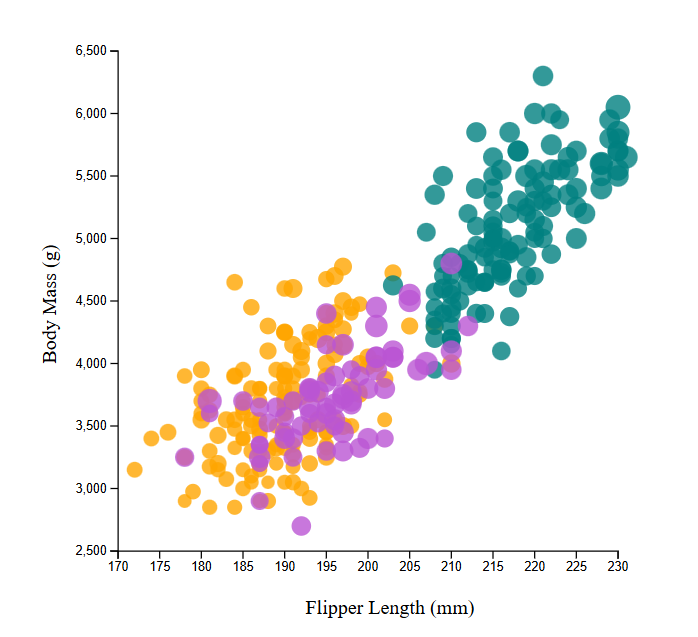
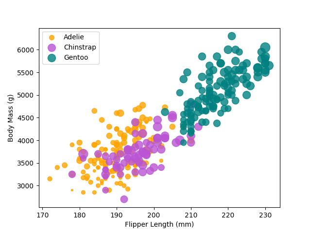
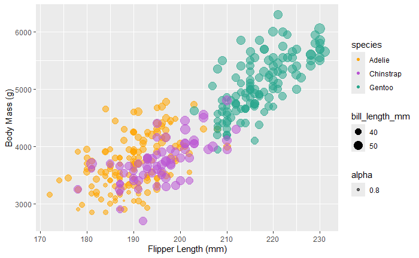
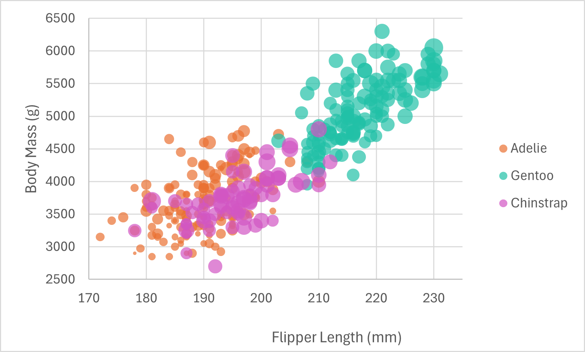
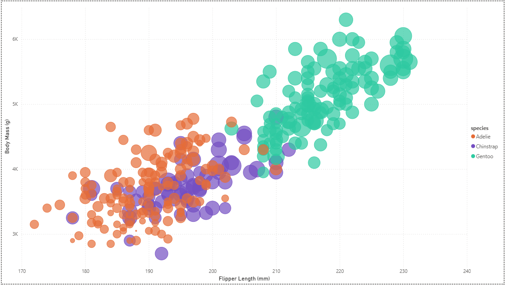

Klaudio Fusha - Assignment 2 - Data Visualization, 5 Ways  
===

# JavaScript + d3

JS + d3 made recreating the visualization somewhat difficult, since it's been a while from the last time I've used d3 for anything of this caliber (past internship 2 years ago). I needed to refer to various resources to get started, make use of certain functions, etc. Granted, it became simple to customize elements as time went on. I definitely see JS + d3 being useful in cases where a lot of customizability is needed. Compared to libraries in other languages (such as matplotlib) or even GUI programs (such as Excel or PowerBI), there is a lot more you can play around with simply due to the nature of d3, even if it is a bit more complex. Regarding hacks or data manipulation, I filtered the data by preserving only the objects where the flipper length was not NA and the body mass was above 2500 grams. The latter was mainly to ensure that points were not placed/rendered below the x-axis. I also manually scaled the bill length by dividing values by 7 in order to size the points.

Resources referenced in code:
- https://d3-graph-gallery.com/graph/scatter_basic.html (main resource referenced, used boilerplate logic)
- https://d3-graph-gallery.com/graph/custom_axis.html#axistitles
- https://d3js.org/d3-scale/ordinal
- http://www.d3noob.org/2014/02/styles-in-d3js.html

# Python + Matplotlib

Python + Matplotlib made the visualization relatively easy to recreate, since I've used both (as well as pandas for data prep) in the past. Being able to easily prep the data with pandas and then feed resulting dataframes into plt.scatter instances was nice. Granted, I needed a refresher on some things, so I used documentation and other resources from the web. Scaling was also a bit difficult/annoying to deal with, but the overall experience was not bad. I can see Python + Matplotlib (and technically pandas) being useful if there needs to be a blend between customizability and simplicity. The extensive documentation on Matplotlib functions can also be really helpful at times, especially if you are just getting started with this type of implementation. Regarding hacks or data manipulation, I dropped NA values from the data and used min-max normalization (multiplied by 200) on the bill length for properly sizing points on the visualization.

Resources referenced in code:
- https://pandas.pydata.org/docs/reference/api/pandas.read_csv.html
- https://www.geeksforgeeks.org/python/normalize-a-column-in-pandas/
- https://www.w3schools.com/python/matplotlib_scatter.asp
- https://matplotlib.org/stable/api/_as_gen/matplotlib.pyplot.scatter.html

# R + ggplot2

R + ggplot2 made recreating the visualization moderately difficult. Although I've used R + ggplot2 before, I haven't used it to this degree (coloring points by species, mapping point size to an attribute, etc). Hence, I had to look up how to do certain things via documentation, forums, and other sources on the web. However, looking back, creating the above visualization took up the least amount of code and was intuitive at times. Additionally, the background grid and legends were added automatically, which made the visualization look more polished without me needing to add more code. This functionality and condensed nature of the code is why I can see R + ggplot2 being useful in cases where a lot of graphs may need to be created (high repetition). Overall, it's even more simple than Python + Matplotlib. Regarding hacks or data manipulation, I didn't have to do much for this implementation, except for removing NA value by changing a default parameter value.

Resources referenced in code:
- https://www.geeksforgeeks.org/r-language/read-contents-of-a-csv-file-in-r-programming-read-csv-function/
- https://r-graph-gallery.com/272-basic-scatterplot-with-ggplot2.html
- https://ggplot2.tidyverse.org/reference/index.html and contained subpages
- https://stackoverflow.com/questions/67480685/r-ggplot-how-to-manually-change-legend-name-and-colors

# Excel

Excel made recreating the visualization pretty easy. After creating a .xlsx version of the penglings.csv file, I was able to convert the raw data in table format. This allowed me to filter out NA values. Then, after inserting a chart, I created data series and added/changed elements (as a note, I initially used a scatter, which was limited and made me search for a different kind of chart -> bubble). However, much like the Python + Matplotlib implementation, making the point sizes be based off of the bill length was not as intuitive. I had to use min-max normalization and configure scaling in the chart menu(s). I can see Excel being useful in cases where coding may be too overkill for visualizing data and establishing surface-level trends, or simply seeing if visualizing data makes sense before comitting to a more complex tool. Regarding hacks or data manipulation, I filtered out NA values and min-max normalized the bill length values in another column.

Resources referenced in spreadsheet:
- https://support.microsoft.com/en-us/office/available-chart-types-in-office-a6187218-807e-4103-9e0a-27cdb19afb90
- https://www.tutorialspoint.com/how-to-adjust-the-bubble-size-in-a-bubble-chart-in-excel
- https://www.geeksforgeeks.org/excel/how-to-normalize-data-in-excel/

# PowerBI

PowerBI made recreating the visualization relatively easy. I loaded in penglings.csv, transformed certain columns (in terms of filtering out NA and changing data types), inserted a scatter chart, and specified/customized corresponding attributes, which was not too bad. Much like Excel (and Python + Matplotlib), I still had to make use of min-max normalization and play around with scaling in the chart menu(s), which was kind of annoying. I can see PowerBI being useful in the same way that I stated for Excel. However, given that this tool is meant for business intelligence, it does appear to have more out-of-the-box functionality than Excel. Perhaps it can be used to create more complex visualizations without having to deal with code (for the most part at least). Regarding hacks or data manipulation, I filtered out NA values and min-max normalized the bill length values in another column much like with Excel.

Resources referenced:
- https://www.statology.org/power-bi-normalize-data-between-0-and-1/

## Technical Achievements
- Called then() on d3.csv() to deal with asynchronicity issues with the JS + d3 logic (specifically when it came to plotting the data points).
- Created a function within then() to filter the data by preserving only the objects where the flipper length was not NA and the body mass was above 2500 grams (so points were not placed below the x-axis). Still within this created function, the filtered data was then passed into another function for plotting the data.
- Made use of min-max normalization in order to normalize the bill length, which helped in sizing the points of the visualization recreations (specifically Python + Matplotlib, Excel, and PowerBI).

**I plan on making JS + d3 and Python + Matplotlib visualizations interactive

### Design Achievements
- Was able to replicate the original visualization almost perfectly across all the different tools/libraries. I made sure to preserve the species color-coding, point sizing, and overall format of the graph (axes ticks and labels, scales, etc.) as much as possible.
